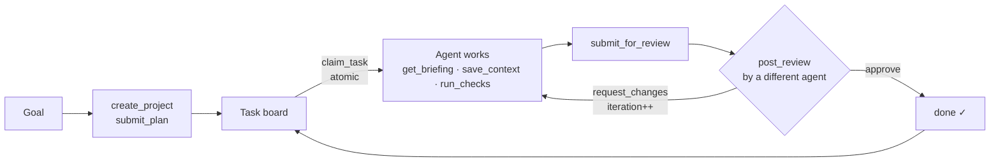

# ForgeSwarm 🛠️🐝

**An MCP server that turns independent AI agents into a coordinated engineering team.**

Most MCP servers give agents *data* (GitHub, databases, web). ForgeSwarm gives them
*coordination*: a shared task board with atomic claiming, a shared context blackboard,
a decision log, and an **enforced plan → implement → review → iterate loop** — the same
workflow shape that powers orchestration harnesses like [CyOps](https://docs.cysic.xyz/cysic-ai/cysic-automation/clack/),
distilled into an open protocol primitive any MCP client can plug into.

Connect Claude Code, Codex, OpenCode, or a MiniMax M3-powered script to the same
ForgeSwarm server, and they instantly become citizens of one swarm: claiming tasks
without collisions, briefing each other through shared memory, and reviewing each
other's work before anything counts as done.

Built for the **CyOps Arena Hackathon — MCP Server Sprint** (co-hosted with MiniMax).

## Why this exists

Multi-agent coding fails in predictable ways: two agents grab the same task, an agent
starts work with no idea what the others decided, "done" means "the model said done",
and a crashed agent silently stalls the project. ForgeSwarm fixes each one **server-side**,
so correctness doesn't depend on prompt discipline:

| Failure mode | ForgeSwarm mechanism |
|---|---|
| Two agents do the same work | `claim_task` is a single atomic conditional `UPDATE` — one winner, always |
| Agent starts cold, repeats settled debates | `get_briefing` bundles goal, constraints, decisions, dependency summaries, and prior review feedback into one onboarding packet |
| "Done" is just an assertion | `submit_for_review` → a *different* agent must `post_review`; self-review is rejected; `request_changes` auto-returns the task to its author with feedback attached and bumps the iteration counter |
| "Tests pass, trust me" | `run_checks` runs allowlisted test/lint commands with a hard timeout and records exit code + output on the task as review evidence |
| Crashed agent stalls the swarm | Claims carry leases; expired leases put tasks back on the board automatically |
| Disagreements evaporate into chat | `open_discussion` → positions from ≥2 distinct agents (server-enforced) → `resolve_discussion` auto-records the consensus as a binding decision in every future briefing |
| The swarm never learns | `get_retrospective` compiles hard evidence — review bounce rates, check pass rates, per-agent stats, hotspot tasks — for the swarm to analyze and act on |
| State lost between sessions | Everything persists in SQLite (WAL) — swarms survive restarts and work across both transports |

## Install

```bash
# with uv (recommended)
uvx forgeswarm

# or with pip
pip install forgeswarm
forgeswarm
```

From source:

```bash
git clone https://github.com/paulchristian/forgeswarm && cd forgeswarm
pip install -e ".[dev]"
pytest   # 20 tests, including end-to-end MCP client sessions
```

### Transports

```bash
forgeswarm                            # stdio (local clients spawn it)
forgeswarm --transport http --port 8765   # one shared endpoint for a whole swarm
forgeswarm --db ./myproject.db        # or set FORGESWARM_DB
```

State is SQLite either way (default `~/.forgeswarm/forgeswarm.db`), so stdio clients —
which each spawn their own server process — still share one swarm.

### Claude Code

```bash
claude mcp add forgeswarm -- uvx forgeswarm
```

Or in any MCP client config:

```json
{
  "mcpServers": {
    "forgeswarm": { "command": "uvx", "args": ["forgeswarm"] }
  }
}
```

## The loop



## Tools (24)

**Planning** — `create_project`, `submit_plan` (whole dependency graph in one call), `list_projects`, `register_agent`

**Task board** — `list_tasks` (with `ready_only`), `claim_task` (atomic, leased), `update_task` (progress + lease renewal), `complete_task`, `get_task_graph`

**Shared context** — `save_context`, `search_context`, `record_decision`, `get_briefing` ⭐

**Review loop** — `submit_for_review`, `get_review_queue`, `post_review`

**Discussion & consensus** — `open_discussion`, `post_to_discussion`, `resolve_discussion` (consensus becomes a recorded decision automatically), `list_discussions`

**Workflow templates** — `list_workflow_templates`, `get_workflow_template` (`ship-feature`, `refactor-module`, `debug-issue` — dependency-wired task graphs ready for `submit_plan`)

**Verification & reflection** — `run_checks` (allowlisted: pytest, ruff, mypy, npm, cargo, go, …; no shell, hard timeout, evidence recorded), `get_retrospective` (swarm performance evidence: bounce rates, iterations, per-agent stats)

## Resources & Prompts

Live swarm state, readable without tool calls:
`swarm://projects` · `swarm://agents` · `swarm://project/{id}/status` ·
`swarm://project/{id}/tasks` · `swarm://project/{id}/decisions` ·
`swarm://project/{id}/discussions` · `swarm://project/{id}/retrospective` ·
`swarm://project/{id}/context`

Role prompts that make any MCP client swarm-ready in one message:
`planner` · `implementer` · `reviewer` · `standup_summary` (rendered from live board state)

## Demo: a MiniMax M3 swarm builds software through ForgeSwarm

[`examples/minimax_swarm_demo.py`](examples/minimax_swarm_demo.py) runs three
MiniMax M3 agents — planner, implementer, reviewer — that coordinate **entirely
through ForgeSwarm tools** over a real MCP stdio session: the planner decomposes a
goal into a task graph, the implementer claims tasks and submits work, the reviewer
approves or bounces it, and the loop runs until the board is green.

```bash
pip install "forgeswarm[demo]"
set MINIMAX_API_KEY=sk-...        # export on macOS/Linux
python examples/minimax_swarm_demo.py "Build a CLI pomodoro timer in Python"
```

M3 is also available through OpenRouter (same model, smaller minimum top-up):

```bash
set MINIMAX_API_KEY=sk-or-...
set MINIMAX_BASE_URL=https://openrouter.ai/api/v1
set MINIMAX_MODEL=minimax/minimax-m3
```

No API key handy? [`examples/quickstart_client.py`](examples/quickstart_client.py)
walks the identical workflow with a scripted client — no LLM required:

```bash
python examples/quickstart_client.py
```

## Architecture

```
src/forgeswarm/
├── server.py        # FastMCP app + stdio/streamable-HTTP entrypoint
├── store.py         # SQLite (WAL): atomic claims, leases, review state machine
├── models.py        # Pydantic contracts returned by every tool
├── tools/           # planning · tasks · context · review · checks
├── resources.py     # swarm:// live state
└── prompts.py       # planner / implementer / reviewer / standup
```

Design choices worth knowing:

- **SQLite over in-memory** — over stdio every client spawns its own server process;
  shared swarm state must live on disk. WAL mode + a busy timeout keeps concurrent
  agents safe, and one conditional `UPDATE` makes claims race-free.
- **The loop is server-enforced** — review outcomes mutate task state in the same
  transaction as the verdict. An agent cannot skip review by prompt injection or
  forgetfulness; the state machine simply won't move.
- **`run_checks` is verification, not execution** — clients already execute code.
  The server's job is *evidence*: allowlisted executables, no shell, hard timeout,
  output recorded where reviewers can see it.

## License

MIT
